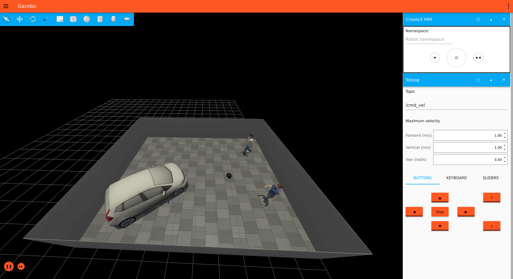
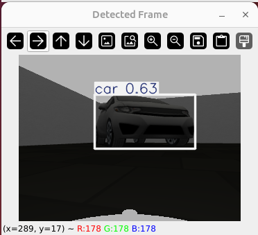

# Turtle_sim

### Requirements
- **Docker** (Docker CLI recommended)
  - Add your user to the Docker group to grant the necessary permissions; otherwise, you must prefix commands with sudo.
  
- **Visual Studio Code** (recommended) with the following extensions:
  - [Docker](https://marketplace.visualstudio.com/items?itemName=ms-azuretools.vscode-docker)
  - [Dev Containers](https://marketplace.visualstudio.com/items?itemName=ms-vscode-remote.remote-containers)

### Docker build
```bash
docker build -t turtle_sim:latest . --build-arg USER_UID=$(id -u)
```

### Run for development
Running docker with GPU support requires [nvidia-container-toolkit](https://docs.nvidia.com/datacenter/cloud-native/container-toolkit/latest/install-guide.html), but if you don't have NVIDIA GPU, you can remove the `--gpus=all` flag in `devcontainer.json` and run this container only with CPU.

Click `Ctrl+Shift+P` and select `Dev Containers: Rebuild and Reopen in Container`. 
This will open the repository in the container and you can start developing.

To rebuild workspace use shortcut `Ctrl+Shift+B` in the vscode.

## Simulation Execution Guide
This section describes how to launch the TurtleBot4 simulation in Gazebo, visualize sensor data in RViz2, and execute the object detection node.

### Prerequisites
Before running the simulation, make sure the workspace has been built and all dependencies are properly installed.

**1. Launch Gazebo Simulation**

Open a terminal and execute the following commands:
```bash
colcon build
source install/setup.bash
ros2 launch turtlebot4_ignition_bringup turtlebot4_ignition.launch.py world:=office model:=lite x:=4 y:=7
```
This command starts the TurtleBot4 Lite model in the `office` world with the specified initial position.

<p align="center">
  
  <br>
  <em>Figure 1: Gazebo simulator view</em>
</p>

**2. Visualize Sensor Data in RViz2**

Open a second terminal and start RViz2:
```bash
source install/setup.bash
rviz2
```
*Add Camera Topics*

*Depth Image*
1. Click Add → By topic
2. Select:
`/oakd/rgb/preview/depth/Image`
3. Configure the display parameters as shown below:

<p align="center">
  
  <br>
  <em>Figure 2: RViz depth image configuration</em>
</p>

*RGB Image*
1. Click Add → By topic
2. Select:
`oakd/rgb/preview/image_raw/Image`

<p align="center">
  
  <br>
  <em>Figure 3: RViz rgb camera view</em>
</p>

**3. Run Object Detection**

Open a third terminal and execute:
```bash
source install/setup.bash
python3 turtlebot_sim/camera_det.py
```

<p align="center">
  
  <br>
  <em>Figure 4: Object detection view</em>
</p>

### Gazebo World Editing — Practical Notes

**Saving the World File**

When adding new objects to the world, it is recommended to save the world as a new file.
Gazebo may sometimes break relative paths and dependencies when modifying existing worlds.

**Downloading Gazebo Models**

Gazebo models can be downloaded from the official model repository:

`https://app.gazebosim.org/dashboard`

Relevant sections include:
- Model plugins
- Joint control
- System plugins (Ignition / Gazebo Sim)

**Editing the World File Locally**

It is recommended to edit the world file locally by modifying the .sdf file directly, for example:

`worlds/world.sdf`

This provides better control over object definitions and dependencies than editing solely through the GUI.

**Running Gazebo with a Specific World**

To launch Gazebo with a selected world file:

`ign gazebo office.sdf`

Replace `office.sdf` with the path to your desired world file if it is not in the current directory.


